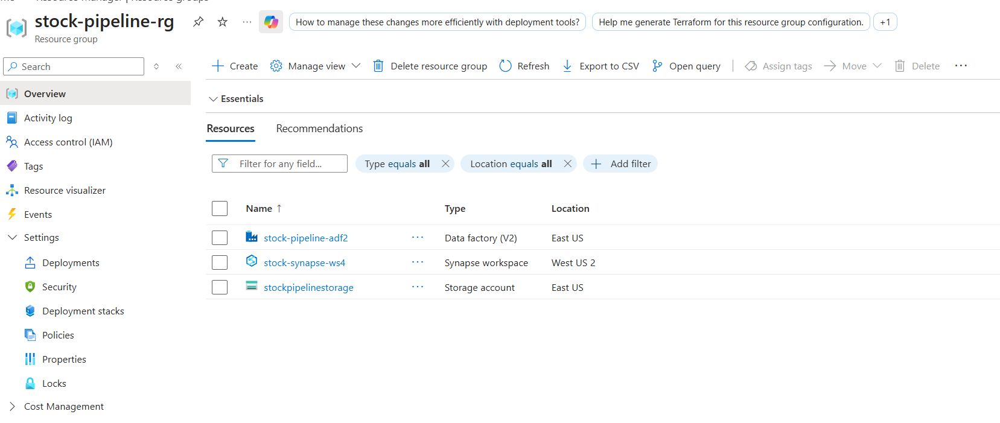
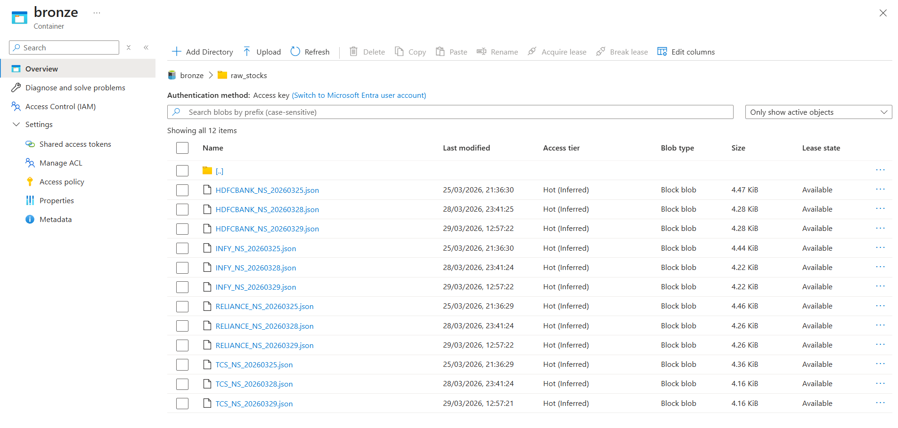
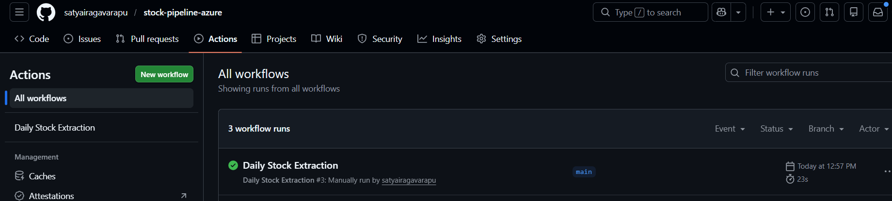
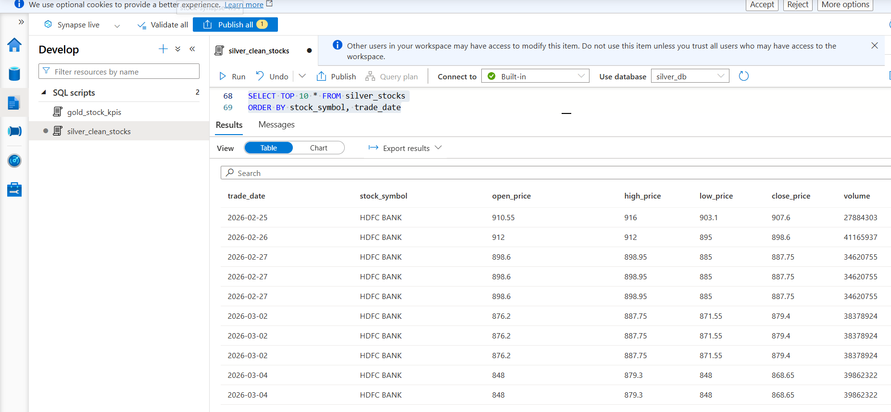
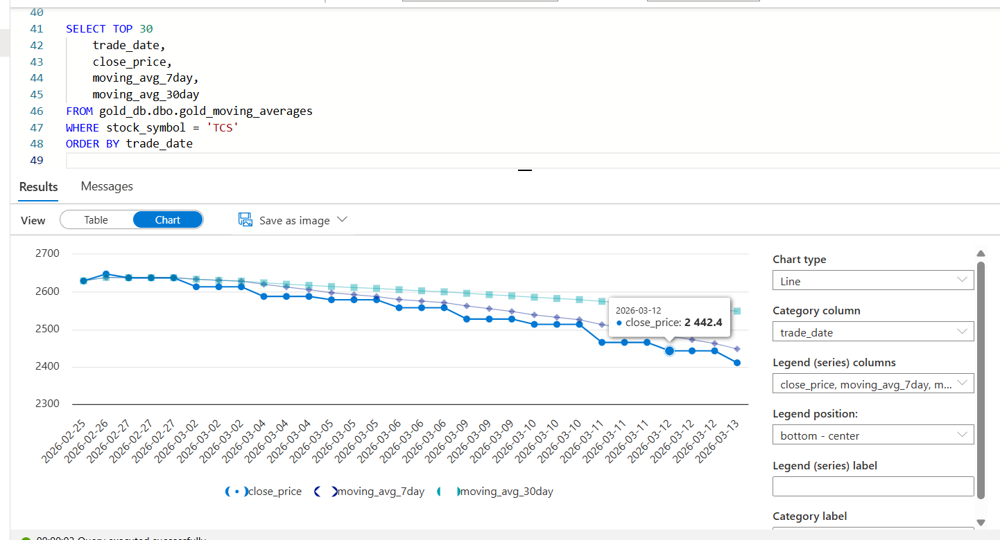
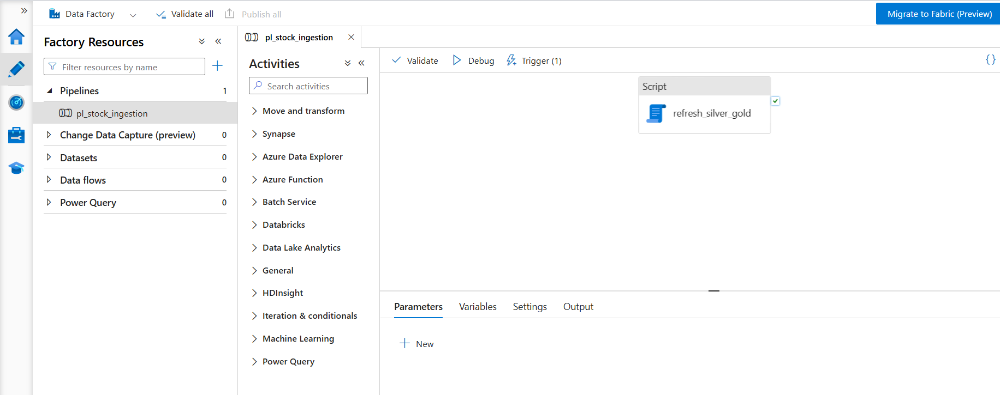

# stock-pipeline-azure
# Stock Market Analytics Pipeline — Azure

An end-to-end data engineering pipeline that ingests daily stock market data, processes it through Medallion Architecture (Bronze → Silver → Gold), and generates KPI analytics using Azure cloud services.

---

## Architecture
```
Yahoo Finance API
        ↓
GitHub Actions (Daily Trigger)
        ↓
ADLS Gen2 — Bronze Layer (Raw JSON)
        ↓
Azure Data Factory — Orchestration
        ↓
Synapse Serverless SQL — Silver Layer (Cleaned Parquet)
        ↓
Synapse Serverless SQL — Gold Layer (KPI Aggregations)
```

---

## Tech Stack

| Layer | Technology |
|---|---|
| Ingestion | Python, yfinance, GitHub Actions |
| Storage | Azure Data Lake Storage Gen2 |
| Orchestration | Azure Data Factory |
| Transformation | Azure Synapse Serverless SQL |
| Version Control | Git, GitHub |

---

## Stocks Tracked

| Symbol | Company |
|---|---|
| TCS.NS | Tata Consultancy Services |
| RELIANCE.NS | Reliance Industries |
| INFY.NS | Infosys |
| HDFCBANK.NS | HDFC Bank |

---

## Medallion Architecture

### Bronze Layer
- Raw OHLCV JSON data fetched daily from Yahoo Finance API
- Stored as-is in ADLS Gen2 bronze container
- One file per stock per day
- No transformations applied — source of truth

### Silver Layer
- Cleaned and structured data
- Transformations applied:
  - Timezone removed from Date column
  - Price decimals rounded to 2 places
  - Dividends and Stock Splits columns dropped
  - NULL records filtered out
  - Stock symbol extracted from filename metadata
- Stored as Synapse Serverless view

### Gold Layer
- KPI aggregations for analytics consumption
- **Moving Averages** — 7 day and 30 day rolling averages per stock
- **Volume Spike Detection** — flags days where volume exceeds 2x 7-day average
- Stored as Synapse Serverless views partitioned by stock symbol

---

## KPIs Generated

| KPI | Description |
|---|---|
| 7 Day Moving Average | Short term price trend per stock |
| 30 Day Moving Average | Long term price trend per stock |
| Volume Spike Detection | Unusual trading activity flag (SPIKE/NORMAL) |
| Daily Price Movement | Open, High, Low, Close per stock per day |

---

## Pipeline Automation

- GitHub Actions triggers daily at 6PM IST
- Fetches latest 1 month OHLCV data for all 4 stocks
- Uploads directly to ADLS Gen2 Bronze container
- ADF pipeline orchestrates Silver and Gold refresh
- Connection string stored as GitHub Secret — never exposed in code

---

## Project Structure
```
stock-pipeline-azure/
    scripts/
        extract_stocks.py       # Fetches from Yahoo Finance → uploads to Bronze
    .github/
        workflows/
            daily_extraction.yml  # GitHub Actions daily trigger
    README.md
```

---

## Key Engineering Decisions

**Why Medallion Architecture?**
Separating raw, cleaned, and aggregated layers enables precise debugging — if Gold KPIs are wrong, check Silver. If Silver is wrong, check Bronze. Each layer is independently queryable.

**Why Synapse Serverless over Dedicated Pool?**
Serverless charges per query (MB scale for this project = ~₹0). Dedicated Pool charges per hour even when idle — unnecessary for a daily batch pipeline.

**Why GitHub Actions over Azure Functions?**
GitHub Actions provides free cloud compute for scheduled jobs without requiring Azure credits. Connection string stored as GitHub Secret ensures credentials are never exposed in code.

**Why ADLS Gen2 over regular Blob Storage?**
Hierarchical Namespace enables folder-level access control and partition pruning — critical for Medallion Architecture and efficient Synapse queries.

---

## Setup Instructions

### Prerequisites
- Azure free account
- GitHub account
- Python 3.11+

### Steps
1. Clone this repo
2. Create Azure resources:
   - ADLS Gen2 storage account with Hierarchical Namespace enabled
   - Azure Data Factory
   - Azure Synapse Analytics workspace
3. Create containers in ADLS: `bronze`, `silver`, `gold`
4. Add GitHub secret: `AZURE_STORAGE_CONNECTION_STRING`
5. Run Synapse SQL scripts to create Silver and Gold views
6. Trigger GitHub Actions workflow manually or wait for daily schedule

---

## Screenshots

### Azure Resource Group


### Bronze Layer — Raw Stock Data in ADLS


### GitHub Actions — Automated Daily Run


### Silver Layer — Cleaned Data


### Gold Layer — TCS Moving Average Chart


### ADF Pipeline — Orchestration


---

## Future Improvements

- Add Power BI dashboard for visual analytics
- Expand to US market stocks (AAPL, GOOGL, TSLA, MSFT)
- Rebuild on GCP (BigQuery + dbt + Looker Studio)
- Add data quality alerting via ADF failure notifications
- Implement incremental loads instead of full refresh